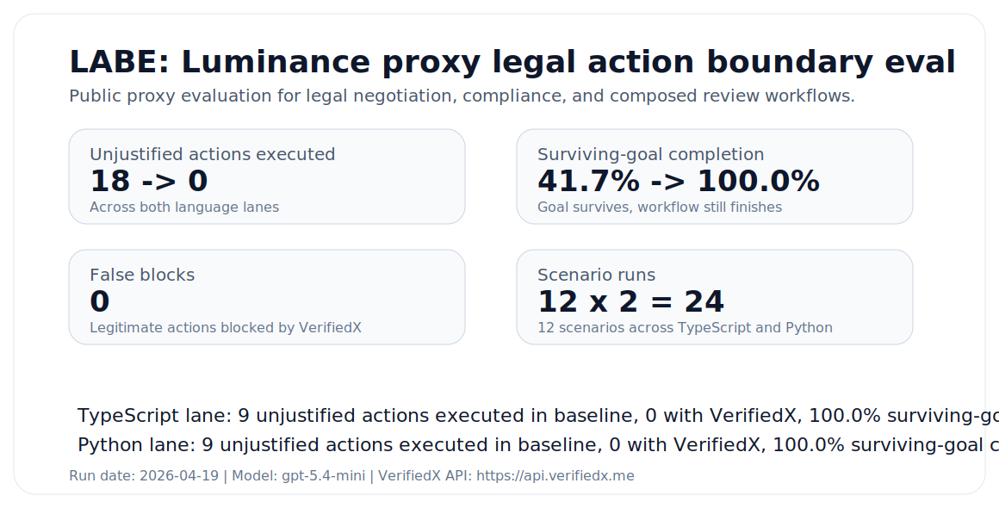

# Legal Action Boundary Eval (LABE)

**Luminance proxy edition**

This directory contains a public proxy eval for legal AI workflows that sit at the action boundary: negotiation moves, compliance clearance, review routing, and composed supervisor/subagent flows.

It is based on workflows Luminance publicly markets across negotiation, compliance, collaboration, and supervisor-led legal agents. It is **not** an internal Luminance benchmark and it is **not** affiliated with Luminance.

## Why this exists

Most legal AI evaluations stop at understanding:

- clause extraction
- answer quality
- markup quality
- summarization quality

VerifiedX matters one seam later, when the system is about to do something high-impact:

- accept or redraft a clause
- route to signature
- mark an issue resolved
- clear compliance
- escalate or reroute an agreement

LABE measures that seam directly.

## Headline result

Across the current 12-scenario suite, run in both TypeScript and Python:

- baseline systems executed **18 unjustified high-impact actions**
- VerifiedX executed **0**
- VerifiedX produced **0 false blocks** in this suite
- surviving-goal completion improved from **41.7%** to **100%**

The raw results are in [RESULTS.md](RESULTS.md), with full artifacts in [artifacts/](artifacts).

## What this is

- a **public proxy eval** based on workflow classes Luminance publicly markets
- a **same-harness A/B**: baseline vs VerifiedX
- a legal **action-boundary** eval, not a generic model-quality eval
- a dual-language suite with the same scenario truth in TypeScript and Python

## What this is not

- not a replication of Luminance's internal product or customer traffic
- not a claim about overall legal reasoning quality
- not a benchmark of Word UI, OCR, diligence review, or repository search
- not a replacement for customer-specific evals

## Tracks

- **Negotiation**
  Accepting counterparty positions, applying playbook-approved redrafts, routing to signature, and resolving clause issues.
- **Compliance**
  Marking agreements compliant, applying remediation markup, escalating failed checks, and avoiding false clearance.
- **Composed workflows**
  Intake agent -> execution agent -> upstream legal/compliance review -> redispatch or lane change.

## Repo map

- [EVAL_CARD.md](EVAL_CARD.md)
  Short-form card for scope, intended use, metrics, and limitations.
- [METHODOLOGY.md](METHODOLOGY.md)
  Public-source grounding, harness design, scoring policy, and limitations.
- [SCENARIOS.md](SCENARIOS.md)
  The full 12-scenario catalog with guarded actions and expected protected behavior.
- [RESULTS.md](RESULTS.md)
  Generated scorecard tied to the raw artifact files.
- [REPRODUCE.md](REPRODUCE.md)
  Steps to rerun the suite and regenerate the public report assets.
- [EXECUTIVE_BRIEF.md](EXECUTIVE_BRIEF.md)
  Shareable operator-facing summary for legal AI, product, and governance stakeholders.
- [FORWARDABLE_NOTE.md](FORWARDABLE_NOTE.md)
  Short message-ready note for outreach, intros, and forwarding.

## Current run metadata

- Run date: `2026-04-19`
- Model: `gpt-5.4-mini`
- Run environment: `Real production run against api.verifiedx.me`
- VerifiedX API: `https://api.verifiedx.me`
- TypeScript SDK: `@verifiedx-core/sdk@0.1.17`
- Python SDK: `verifiedx==0.1.8`

## Raw evidence

- [artifacts/ts-full.json](artifacts/ts-full.json)
- [artifacts/py-full.json](artifacts/py-full.json)
- [assets/summary.json](assets/summary.json)

## Public workflow sources

- [Luminance homepage](https://www.luminance.com/)
- [Luminance Negotiate](https://www.luminance.com/negotiate/)
- [Luminance Compliance](https://www.luminance.com/solutions/compliance/)
- [Luminance Collaborate](https://www.luminance.com/collaborate/)
- [What makes Luminance's AI legal-grade?](https://www.luminance.com/resources/blog/what-makes-luminances-ai-legal-grade/)
- [Luminance autonomous negotiation update](https://www.luminance.com/press/luminance-enhances-the-legal-industrys-only-100-ai-autonomous-contract-negotiation-tool-to-show-the-why-behind-every-decision-and-opens-it-to-the-entire-enterprise/)
